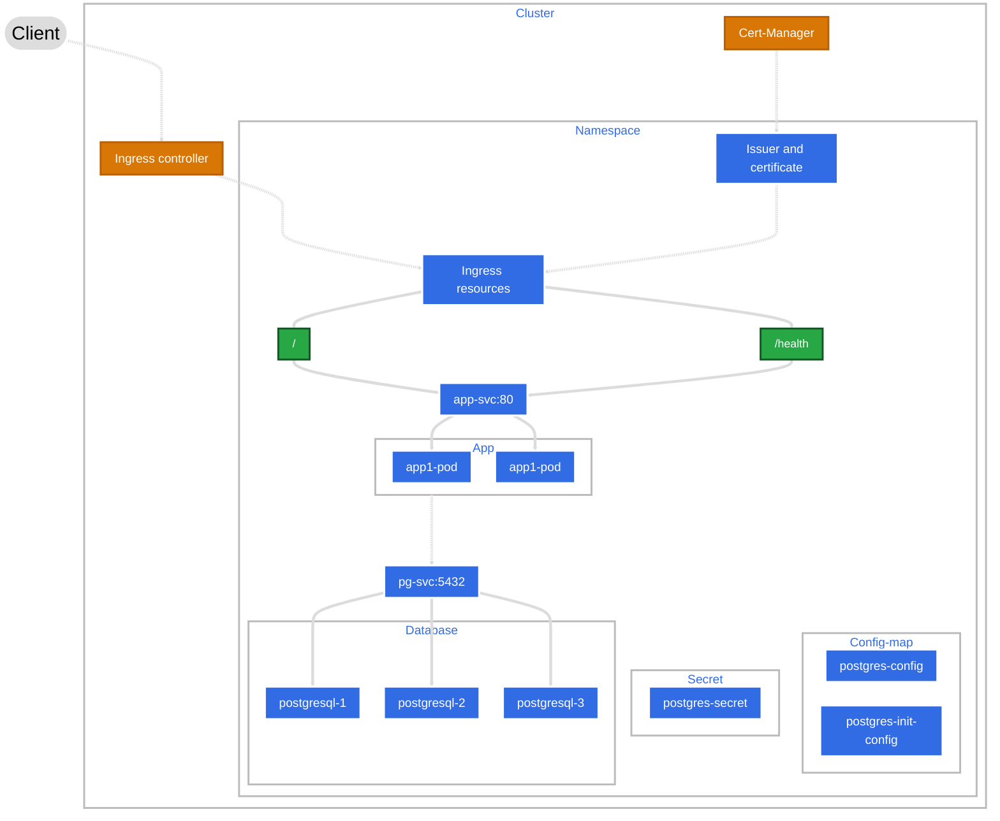

# Python-based Todo Application

## Application image:


## Architecture Diagram:


## Documentation/Blogs:

1. Orchestration using 
[Docker-compose](https://minex.hashnode.dev/simple-docker-compose-deployment-for-python-based-todo-applications)

    Refer to the docs/docker-steps.sh and docs/docker-compose-steps.sh for better understanding.

    ```
    todo-application
    ├── app
    │   ├── app.py
    │   ├── Dockerfile
    │   ├── .dockerignore
    │   ├── requirements.txt
    │   └── templates
    │       └── index.html
    ├── docker-compose.yml
    ├── docs
    │   ├── docker-compose-steps.sh
    │   └── docker-steps.sh
    ├── .env.sample
    ├── init.sql
    └── README.md
    ```

    ```
    git clone --branch docker-compose https://github.com/minex970/python-based-todo-application.git
    ```

2. Orchestration using [kubernetes](https://minex.hashnode.dev/how-to-deploy-todo-apps-with-kubernetes-a-step-by-step-guide)

    Refer to the docs/kubernetes-steps.sh if needed.

    ```
    k8s-manifests/
    ├── app
    │   ├── appDeployment.yaml
    │   └── appService.yaml
    └── database
        ├── postgresCluster.yaml
        ├── postgresConfigMap.yaml
        ├── postgresInitConfigMap.yaml
        └── postgresSecret.yaml
    ```

    ```
    git clone --branch k8s-base https://github.com/minex970/python-based-todo-application.git
    ```

3. Auto-scaling: [HPA in kubernetes](https://minex.hashnode.dev/how-to-auto-scale-todo-apps-on-kubernetes-for-better-performance)

    Refer to the tests/steps.sh if needed.

    ```
    k8s-manifests/
    └── auto-scaling
        └── horizontalPodAutoScaler.yaml

    tests/
    ├── load-testing.js
    └── steps.sh
    ```

    ```
    git clone --branch k8s-autoscaling https://github.com/minex970/python-based-todo-application.git
    ```

4. Application with [Ingress with SSL/TLS](https://minex.hashnode.dev/securing-todo-apps-implement-kubernetes-ingress-with-ssltls)

    Refer to the docs for steps.
    ```
    k8s-manifests/
    ├── cert-manager
    │   ├── letsencryptCertificate.yaml
    │   ├── letsencryptClusterIssuer.yaml
    │   ├── selfsignedCertificate.yaml
    │   └── selfsignedClusterIssuer.yaml
    └── route
        └── appIngress.yaml
    ```

    ```
    git clone --branch k8s-ingress-ssl https://github.com/minex970/python-based-todo-application.git
    ```
